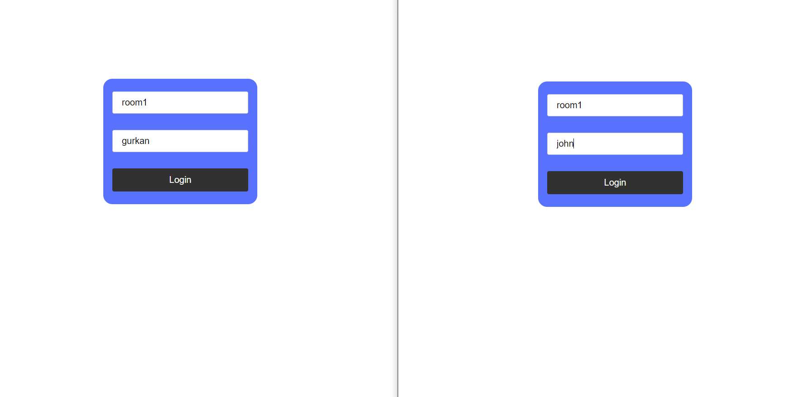

# Socket io chat example backend


### Tech Stack

**Spring Boot**

**Netty Socket IO:** socket server

**H2 db:** socket server

&nbsp;

### How to run

#### clone the project: https://github.com/gurkanucar/socketio-simple-chat

```bash
  git clone https://github.com/gurkanucar/socketio-simple-chat
```

#### run

```bash
  cd backend
  
  mvn spring-boot:run
```

### Note that!
#### You have to configure ip and port details from "application.properties" file.

socket-server.host=192.168.0.10 // write your ip address not local host


## Example Images




### Example Video:

[https://www.youtube.com/watch?v=y7jnF7MuNLI](https://www.youtube.com/watch?v=y7jnF7MuNLI)

### Frontend:

[https://github.com/gurkanucar/socketio-simple-chat/tree/master/frontend](https://github.com/gurkanucar/socketio-simple-chat/tree/master/frontend)
